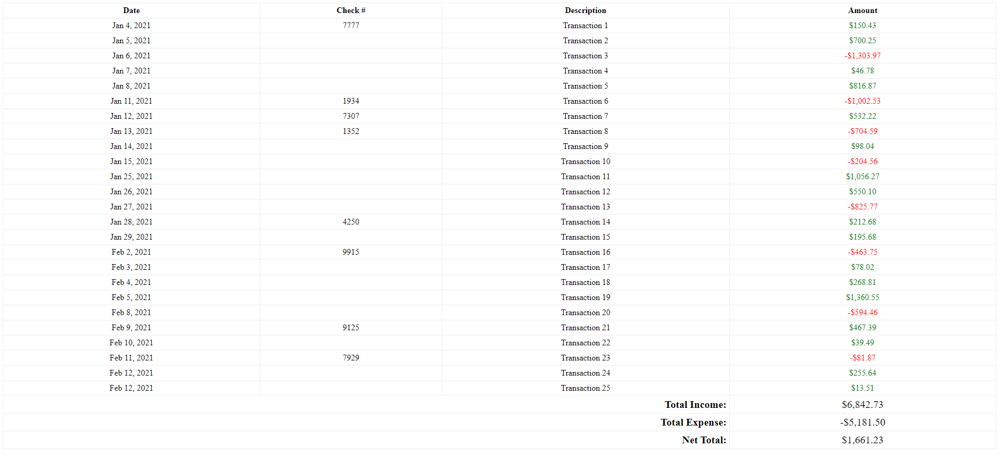

#### The project for the PHP course "Learn PHP The Right Way".

--- 
#### Branches
* **main** - Will contain the finished project code, if you are following a specific lesson then you should switch to the appropriate branch to follow along
* **1.x** - Project code for the first section of the course where **x** indicates the video number where it was implemented
* **2.x** - Project code for the second section of the course where **x** indicates the video number where it was implemented
* **3.x** - Project code for the third section of the course where **x** indicates the video number where it was implemented

---
#### Related Video
https://youtu.be/oXcX4ucj32M

---
#### Course Playlist
https://www.youtube.com/watch?v=sVbEyFZKgqk&list=PLr3d3QYzkw2xabQRUpcZ_IBk9W50M9pe-

---
#### Instructions
1. Set document root to _YOUR_PROJECT/public_, that way the site is loaded from _public/index.php_
   * You should include/require all other files in _index.php_, that's your main file
   * You can use APP_PATH, FILES_PATH & VIEWS_PATH constants that are defined in _index.php_ to help you with including files
2. Main code should go in app directory in any file that you choose, I created empty App.php that you can use to place your main logic but feel free to change it
   * You should define multiple functions there which will read **all** files within _transaction_files_ directory and process them. It is up to you how you want to read those files, but the goal is to read all files within that directory
   * You can assume that all files within _transaction_files_ directory are **.csv** files
   * One sample file is provided which contains formatted data
   * You can assume that all files in _transaction_files_ directory will be of same format for now
3. Store data in memory (in an array)
   * First column is the date of the transaction
   * Second column is the check # which is optional & is not always provided
   * The third column is transaction description
   * The fourth column is the amount (negative number indicates it's an expense, positive number indicates it's an income)
4. Calculate the total income, total expense & net total (total income - total expense)
5. Print a simple HTML table containing all the data from the files
   * The html skeleton is provided in views/transactions.php file
   * The date of the transaction should be in this format "Jan 4, 2021"
   * Show income amounts in green color & show expense amounts in red

Here is an example of what the table should look like

